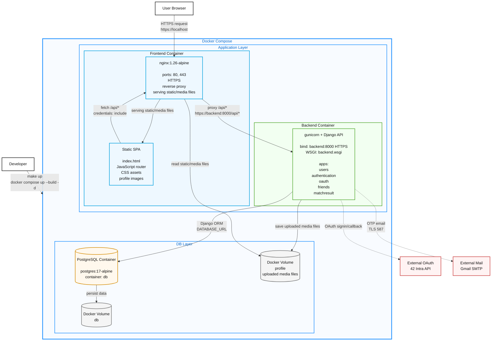

# ft_transcendence Architecture

`img/arch.png` 스타일을 기준으로, 현재 프로젝트를 Docker Compose 안의 프론트엔드/백엔드/DB 컨테이너 레이어로 표현한 Mermaid 아키텍처다.

## 구성 요약

| Layer | Container | 역할 |
| --- | --- | --- |
| Frontend | `frontend` | nginx로 정적 파일과 업로드 미디어를 서빙하고 `/api/*`를 백엔드로 프록시 |
| Backend | `backend` | gunicorn으로 Django API를 실행하고 인증, OAuth, 친구, 경기 결과 기능 처리 |
| DB | `db` | PostgreSQL 17 컨테이너로 애플리케이션 데이터 저장 |

## 주요 흐름

1. 사용자는 `https://localhost`로 `frontend` 컨테이너의 nginx에 접근한다.
2. nginx는 SPA 파일을 응답하고, `/api/*` 요청은 `backend:8000`으로 프록시한다.
3. Django 백엔드는 PostgreSQL 컨테이너에 ORM으로 접근한다.
4. 프로필 이미지는 `profile` 볼륨에 저장되고 nginx의 static/media serving 책임으로 제공된다.
5. 백엔드는 42 Intra OAuth API와 Gmail SMTP를 외부 서비스로 사용한다.
