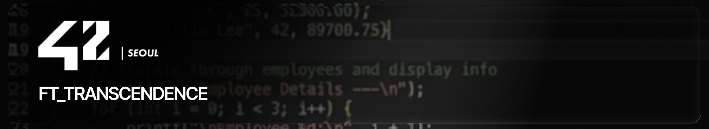
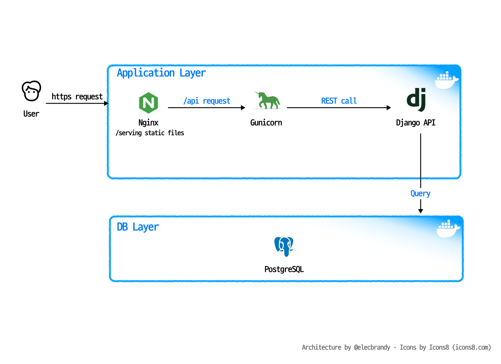

# ft_transcendence



<br>

## 📌 Overview

> _**42 Seoul 공통과정 ft_transcendence 웹 서비스 프로젝트**_

- **프로젝트 주제**: 실시간 Pong 게임과 사용자 관리 기능을 제공하는 웹 애플리케이션
- **프로젝트 목표**: 인증, 2FA, OAuth, 프로필, 친구, 토너먼트, 경기 기록을 하나의 서비스로 통합
- **실행 환경**: `Docker Compose` 기반 컨테이너 구성

<br>
<br>

## 🏓 `ft_transcendence` 란?

- **`ft_transcendence`** 는 브라우저에서 Pong 게임을 플레이하고 사용자 계정, 프로필, 친구, 경기 이력을 관리할 수 있는 웹 서비스입니다.
- 프론트엔드는 정적 SPA로 로그인, 회원가입, 프로필, 게임 옵션, 토너먼트, 게임 화면을 제공합니다.
- 백엔드는 Django API 서버로 JWT 쿠키 인증, 이메일 OTP 2FA, 42 Intra OAuth, 친구/온라인 상태, 경기 결과 저장을 처리합니다.
- nginx, gunicorn, PostgreSQL을 Docker Compose로 묶어 HTTPS 기반 로컬 실행 환경을 구성했습니다.

<br>
<br>

## 🏗️ System Architecture



<br>
<br>

## 📂 Repositories

| Repository | Description |
|---|---|
| `srcs/requirements/frontend` | nginx 기반 정적 SPA. Bootstrap UI, hash router, Three.js Pong 게임, 프로필/친구/토너먼트 화면 |
| `srcs/requirements/backend` | Django + gunicorn 기반 API 서버. 사용자, 인증, OAuth, 친구, 경기 결과 앱 포함 |
| `srcs/requirements/backend/srcs/users` | 커스텀 유저 모델, 회원가입, 로그인, 로그아웃, 탈퇴, 프로필 이미지, 계정 설정 API |
| `srcs/requirements/backend/srcs/authentication` | JWT 발급/검증, HttpOnly Secure Cookie, 이메일 OTP 2FA, 쿠키 상태 확인 |
| `srcs/requirements/backend/srcs/oauth` | 42 Intra OAuth 로그인 URL 생성 및 callback 처리 |
| `srcs/requirements/backend/srcs/friends` | 친구 검색, 추가, 삭제, 목록 조회, 온라인 상태 조회 |
| `srcs/requirements/backend/srcs/matchresult` | Pong 경기 결과, 점수, 상대 이름, 경기 시간 저장 및 조회 |
| `srcs/docker-compose.yml` | `frontend`, `backend`, `db` 서비스, bridge network, `profile`/`db` volume 정의 |
| `Makefile` | `make`, `make up`, `make down`, `make clean` 실행 명령 |

<br>
<br>

## 🛠️ Tech Stack

| Area | Stack |
|---|---|
| Frontend | HTML, CSS, JavaScript, Bootstrap, Bootstrap Icons, Three.js |
| Web Server | nginx 1.26-alpine, HTTPS, static/media serving, reverse proxy |
| Backend | Python 3.11, Django, gunicorn |
| Authentication | JWT, HttpOnly Secure Cookie, Email OTP 2FA, 42 Intra OAuth 2.0 |
| Database | PostgreSQL 17-alpine |
| Storage | Docker volume `profile`, Docker volume `db` |
| Infra | Docker, Docker Compose, bridge network |

<br>
<br>

## 🚀 How to Run

`.env.example`을 복사해 실행 환경에 맞게 값을 채웁니다.

```bash
# env 설정
cp srcs/.env.example srcs/.env

# 서비스 실행
make up
```

서비스 실행 후 브라우저에서 접속합니다.  
로컬 자체 서명 인증서를 사용하므로 브라우저에서 인증서 경고가 표시될 수 있습니다.

```text
https://localhost
```


<br>
<br>

## 👥 Team

| 팀원 | hwjdghks | sejkim2 | minkyole | elecbrandy | minjeongKim |
|---|---|---|---|---|---|
| 역할 | `PM/BE` | `BE` | `BE` | `FE` | `FE` |

<br>
<br>

_*사람이 작성함_
